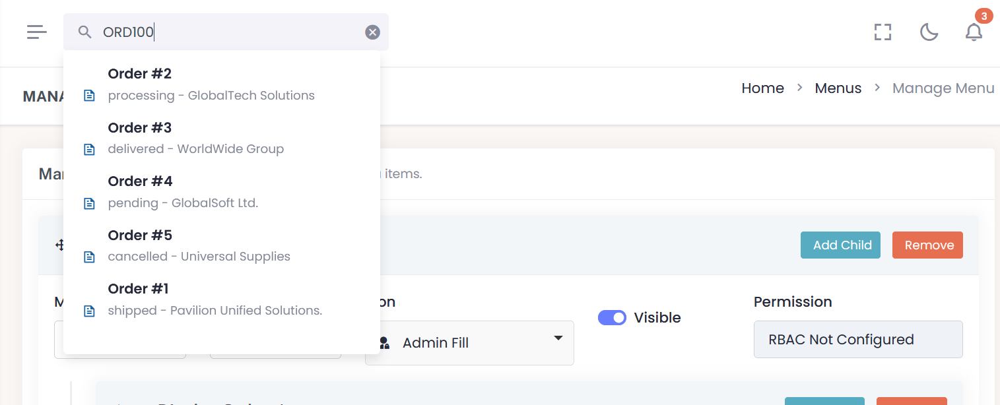

# yii2-admin-theme

### Develped by:


A customizable admin theme extension for Yii2 that supports:

- **Dynamic Admin Menu** management with drag-and-drop UI
- **Theme Appearance Settings** (colors, layout, typography, branding)
- Full **RBAC permission support** per menu item
- **Global Search** search data from any model desired 

> Built to simplify theming and menu configuration for Yii2 admin panels.

---

## 🔧 Installation

Install via Composer:

The preferred way to install this extension is through [composer](http://getcomposer.org/download/).

Either run

```bash
composer require sahmed237/yii2-admin-theme "*"
```

or add

```
"sahmed237/yii2-user": "^1.0"
```

to the require section of your `composer.json` file.


## Run the required migrations:
```bash
php yii migrate --migrationPath=@vendor/sahmed237/yii2-admin-theme/src/migrations
```
---

Add the module and view theme to your application config (`config/web.php` or `config/main.php`):

```php
'modules' => [
    'yii2admintheme' => [
      'class' => \sahmed237\yii2admintheme\Module::class,
      'permissionRule' => 'your-permision-rule'
    ],
]

'components' => [
    'view' => [
        'theme' => [
            'pathMap' => [
                '@app/views' => '@vendor/sahmed237/yii2-admin-theme/src/views',
            ],
        ],
    ],
],
```
## 🔐 Access Control & Permission Configuration

To control access to the admin theme’s menu and theme settings management features, you can define a custom RBAC role by configuring the `permissionRule` property in the module definition. This ensures that only users with the appropriate role (e.g., `admin`, `superAdmin`) can access protected controller actions.

By default, if `permissionRule` is not explicitly set, all authenticated users (`@`) will be granted access.
### Example Configuration

```php
'modules' => [
    'admin' => [
        'class' => \sahmed237\yii2admintheme\Module::class,
        'permissionRule' => 'superAdmin', // Only users with 'superAdmin' role can access
    ],
],

```
### How It Works
Internally, the module dynamically injects this value into the controller’s access behavior:
```php
'roles' => $module->permissionRule ? [$module->permissionRule] : ['@'];
```
This allows for flexible permission handling without the need to override controller behavior manually.

> **NOTE:** Make sure that you have properly configured **db** application component.

## 📁 Folder Structure
```
yii2-admin-theme/src
├── Module.php
├── assets/
├── controllers/
│   ├── MenuController.php
│   └── SettingController.php
├── models/
│   ├── AdminMenu.php
│   └── AdminThemeSetting.php
├── views/
│   │── layouts/
│   │   ├── _customizer.php
│   │   ├── _footer.php
│   │   ├── _main.php
│   │   ├── _menu.php
│   │   ├── _page_title.php
│   │   ├── _title-meta.php
│   │   ├── main.php
│   │   ├── sidebar.php
│   │   ├── topbar.php 
│   ├── menu/
│   │   ├── index.php
│   │   └── _form.php
│   └── setting/
│       └── index.php
├── widgets/
│   ├── DynamicMenu.php
│   └── ThemeAsset.php
└── migrations/
├── m000000_000000_create_admin_menu_table.php
└── m000000_000001_create_admin_theme_setting_table.php
```
# 📂 Features
## 1. 🧩 Admin Menu Builder


### Manage navigation menus with:
- Drag-and-drop hierarchy 
- Unlimited nesting 
- AJAX-based creation
- Visibility toggles
- RBAC permission-based access

### Fields:
- label (Menu name)
- route (e.g. site/index)
- icon (Remixicon, Boxicon materialdesignicon,  deshin)
- rbac_permission (e.g. admin.access)
- visible (checkbox)
- order (automatically set by drag position)

### How to Use:
*visit:*

`/admintheme/menu`

- Click "Add Root Item" to create a top-level item
- Use "Add Child" or drag-drop to nest items
- Press "Save Menu" to persist the menu structure

 You can render the menu with:

```php
 use sahmed237\admintheme\widgets\DynamicMenu;

 echo DynamicMenu::widget();
```
### 🛡️ RBAC Integration
>Each menu item supports an optional rbac_permission value. If set, the menu item will only be visible to users with that permission using Yii's built-in RBAC system.

## 🔔 Menu Badge Support
>Display dynamic badges (e.g., counts, notifications) on menu items by configuring a global badge callback function.

### ✅ Add Badge Logic to params.php
Define a menuBadgeCallback in your application config (e.g., config/params.php or config/params-local.php):
```php
use app\models\Order;

return [
    // ... other params ...
    'menuBadgeCallback' => function($menuItem) {
         if ($menuItem->route === '/order/pending') {
            $pendingCount = Order::find()->where(['status' => 'pending'])->count();
            return $pendingCount > 0 ? ['count' => $pendingCount, 'class' => 'bg-primary'] : 0;
        }

        if ($menuItem->route === '/messages') {
            return ['count' => 3, 'class' => 'bg-warning']; // Another example
        }

        return 0; // No badge
    },
    // Other params
];
```
- `count`: The number or symbol to show in the badge.

- `class`: Bootstrap-compatible class for the badge (e.g., bg-danger, bg-warning, etc.).

 ### ✅ Optional: Future Support
  You can even enhance your callback like:
```php
return [
    'count' => $someCount,
    'class' => $someCount > 10 ? 'bg-danger' : 'bg-info'
];

```

### 🛠 How It Works
The `DynamicMenu` widget reads the global badge callback from `Yii::$app->params['menuBadgeCallback']` and attaches badges to menu items during rendering.


### 🧑‍🎨 Badge Styling
Badges are rendered with the default Bootstrap 5 badge class:
```html
<span class="badge float-end {class}">{count}</span>
```
### 📸 Menu Preview


---
# 2. 🎨 Theme Settings

> Customize the appearance of your admin panel without modifying code.

**Options:**

- **Layout:**

  - Sidebar: Light / Dark / Gradient / sidebar image
  - Topbar: Light / Dark

- **Colors:**

    - Primary, Secondary, Warning, Info, Danger

- **Typography:**

    - [Font Family, Font Size](docs/typography.md)

- **Branding:**
  - [Logo image, Favicon](docs/branding_logo_upload.md)

*Visit:*

`/admintheme/setting`

Your settings are saved in the `admin_theme_setting` table and applied via `ThemeAsset`

# Advance Features

## 🔍 Global Search
> The admin theme includes a customizable global search widget with support for searching across multiple models like Orders, Products, etc. It is designed to be:



- **Extensible** – Easily add new models by implementing a globalSearch($term) static method. 
- **Unified** – Each result includes an icon, title, description, and URL. 
- **Flexible** – Fully AJAX-based with clean UI integration.

### How to Enable Global Search
1. Create a SearchController with an `actionGlobalSearch()` method.
2. In each model you want to include in the search, define a static method like this:
```php
public static function globalSearch($term)
{
    return [
        [
            'icon' => 'ri-file-text-line', // set to null if icon not needed
            'title' => 'Sample Title',
            'description' => 'Optional Description',
            'url' => Url::to(['/model/view', 'id' => $id])
        ]
    ];
}
```
3. Define a `searchRoute` in your application config (e.g., config/params.php or config/params-local.php) with value of the search controller URL e.g:
```php
return [
    'searchRoute' => '/search/global-search',
    // Other Params
];
```

4. The widget will automatically query the controller and display matching results.

### Sample `SearchController` and `Model` 
- [SearchController Sample](docs/search_controller_sample.md)
- [Model Sample](docs/model_sample.md)
---
## User Dropdown
> The UserDropdownWidget provides a professional user profile dropdown menu for your application’s top bar. It displays the logged-in user’s name, profile image, and a customizable dropdown menu with navigation links.


### Features
- Displays user name and "User since" date.
- Supports custom profile images configurable via params. 
- Dynamic dropdown menu items loaded from configuration. 
- Graceful fallback to a default user image. 
- Fully Bootstrap 5 dropdown compliant.

### Configuration via `params.php`

### User Image
Set the base image path or full URL for the user profile image:
```php
return [
    // If your user model saves only the filename, this should be the base path.
    // Example: 'userImagePath' => '/uploads/avatars/' . Yii::$app->user->identity->profile_img
    // Or use a full URL like: 'https://cdn.example.com/avatars/filename.jpg'
    // You can also directly set a full image path, e.g. '/uploads/avatars/user-dummy.png'
    'userImagePath' => \Yii::$app->user->identity->profile_img,

    // other parameters ...
];
```
The widget will use this path to display the user image. If no user image is configured, it falls back to a default dummy image bundled with the theme assets.

### User Dropdown Menu Items
Configure the dropdown menu links dynamically in your params:

```php
return [
    'userMenuItems' => [
        [
            'icon' => 'mdi mdi-account-circle',
            'label' => 'Profile',
            'url' => ['pages-profile'],
        ],
        [
            'divider' => true,  // Adds a divider line
        ],
        [
            'icon' => 'mdi mdi-key-change',
            'label' => 'Change Password',
            'url' => ['/user/security/change-password'],
        ],
        [
            'icon' => 'mdi mdi-two-factor-authentication',
            'label' => 'Enable 2FA',
            'url' => ['/twofactor/two-factor/setup'],
        ],
        [
            'icon' => 'mdi mdi-logout',
            'label' => 'Logout',
            'url' => ['/user/security/logout'],
            'options' => ['data-method' => 'post'],
        ],
    ],

    // other parameters ...
];
```
### How It Works
- The widget fetches the currently logged-in user via `Yii::$app->user->identity`. 
- If no user is logged in, the widget returns an empty string (nothing rendered). 
- The user image URL is constructed from `params['userImagePath']`. 
- The dropdown menu items are loaded from `params['userMenuItems']` allowing you to customize links and icons without modifying the widget code. 
 - Menu dividers can be inserted using `'divider' => true`.

### Notes
- Make sure your user identity class has name and created_at properties.
- This widget is Bootstrap 5 compatible and uses Material Design Icons (mdi).
---

## 🔔 NotificationDropdownWidget
> The `NotificationDropdownWidget` is a dynamic, interactive widget that displays recent user notifications in a dropdown format. It supports:


- AJAX-based polling for new notifications
- Marking notifications as read
- Customizable controller routes
- Configurable notification sound with fallback to default asset
- Integration-ready design for admin topbars
### 📦 Features

- Real-time polling (via AJAX)
- Click-to-mark-as-read functionality
- Automatically updates unread count
- Supports custom controller routes
- Sound alert on new notifications
- Fully extensible and configurable
### 🛠 Usage
Render the widget in the admin theme layout topbar

```php
use sahmed237\yii2admintheme\widgets\NotificationDropdownWidget;

echo NotificationDropdownWidget::widget([
    'limit' => 5, // Optional, number of latest notifications to show
]);
```

### ⚙️ Configuration Options
### Important!
Reference the module name in your (e.g., `config/params.php` or `config/params-local.php`):

```php
return [
    'adminThemeModuleName' => 'yii2admintheme-module-name', 
    // or whatever you set the admin theme module name in your config
];
```
in case you didn't define `adminThemeModuleName` in params the widget will try to use default `/yii2adminthemenotification/...` for routing.

### 📢 Notification Sound
This widget supports an optional notification sound when new notifications arrive.
### ✅ Default Sound
If not configured, the default sound located in the `assets/sound/notification-1.mp3` directory will be used. The file is published via `AssetManager`:
```php
Yii::$app->assetManager->getPublishedUrl('@vendor/sahmed237/yii2-admin-theme/src/assets') . '/sound/notification-1.mp3'
```
### 🔧 Custom Sound
To override the sound, define a custom path in your application `params.php` :
```php
return [
    'adminThemeNotificationSound' => '/media/alerts/notify.mp3',
];
```
### 🔄 Polling Behavior
The widget uses AJAX polling to fetch the latest unread notifications in real-time. The polling interval can be customized in your (e.g., `config/params.php` or `config/params-local.php`):
```php
return [
    'notificationPoolingInterval' => 10000 //In milliseconds
]
```
### 🔗 Notification Table Format
| Column       | Type        | Description                      |
|--------------| ----------- |----------------------------------|
| `id`         | `int`       | Primary key                      |
| `user_id`    | `int`       | Recipient user ID                |
| `message`    | `string`    | Notification message             |
| `url`        | `string`    | (Optional) Redirect URL on click |
| `icon`       | `string`    | (Optional) Icon for the item     |
| `is_read`    | `boolean`   | Whether the notification is read |
| `created_at` | `timestamp` | Date of creation                 |


### Notification Component
There is a built in Notification Component that provides a simple way for developers to push new notifications into the database for specific users.
It can be used across your application to send alerts, reminders, or any custom messages to users.
### Usage
1. Register the Component In your application config `(web.php` or `main.php`):
```
'components' => [
    'notification' => [
        'class' => app\components\NotificationComponent::class,
    ],
],
```
2. Push a Notification Use it anywhere in your code:
```php
$result = Yii::$app->notification->push([
    'user_id' => 5,
    'title' => 'New Message',
    'message' => 'You have received a new private message.',
    'url' => ['/messages/view', 'id' => 123],
    'category' => 'message',
    'icon' => 'bx bx-envelope',
]);

if ($result['success']) {
    Yii::info('Notification sent successfully.');
} else {
    Yii::error('Notification failed: ' . json_encode($result));
}
```
### 🛠 Method Details
`push(array $data)`: array 
Push a new notification to the database.
### Parameters
| Key        | Type   | Required | Default            | Description                             |
| ---------- | ------ | -------- | ------------------ | --------------------------------------- |
| `user_id`  | int    | ✅ Yes    | —                  | The user ID to receive the notification |
| `title`    | string | ✅ Yes    | —                  | Notification title                      |
| `message`  | string | ✅ Yes    | —                  | Notification body text                  |
| `url`      | string | ❌ No     | `null`             | Link to redirect when clicked           |
| `category` | string | ❌ No     | `'info'`           | Notification category/type              |
| `icon`     | string | ❌ No     | `'bx bx-envelope'` | Icon CSS class for display              |

**Return Value** Returns an array with:
```php
[
    'success' => true|false,
    'error'   => 'Error message if failed',
    'errors'  => ['field' => ['Error text']] // Only if model validation fails
]
```
### ⚠ Error Handling
- Returns `success: false` with an `error` string if:
  - The notification model class does not exist.
  - Required fields are missing.
- Returns `success: false` with `errors` array if:
  - Model validation fails.

### 📌 Notes
- The `created_at` field is automatically set to the current timestamp. 
- By default, `is_read` is set to 0 (unread).
# 🛠 Technologies Used
- SortableJS – for drag-and-drop menu reordering

- Pickr – for color selection

- Remixicon, Boxicon, Medeadesignicon


# 📣 Contributing
Pull requests and suggestions are welcome!

To contribute:

- Fork this repository
- Make your changes
- Create a pull request

## 🙏 Support This Project

This project is maintained in my free time. If you find it helpful and would like to support continued development, consider buying me a coffee or donating via PayPal.

**💰 PayPal**  
[https://www.paypal.me/sadiqahmed237](https://www.paypal.me/sadiqahmed237)

Your support is appreciated and helps keep this project growing! Thank you. 🤝

# 📃 License
MIT License © 2025 Sadiq Ahmed Bello

# 🔗 Author
Developed and maintained by Sadiq Ahmed Bello