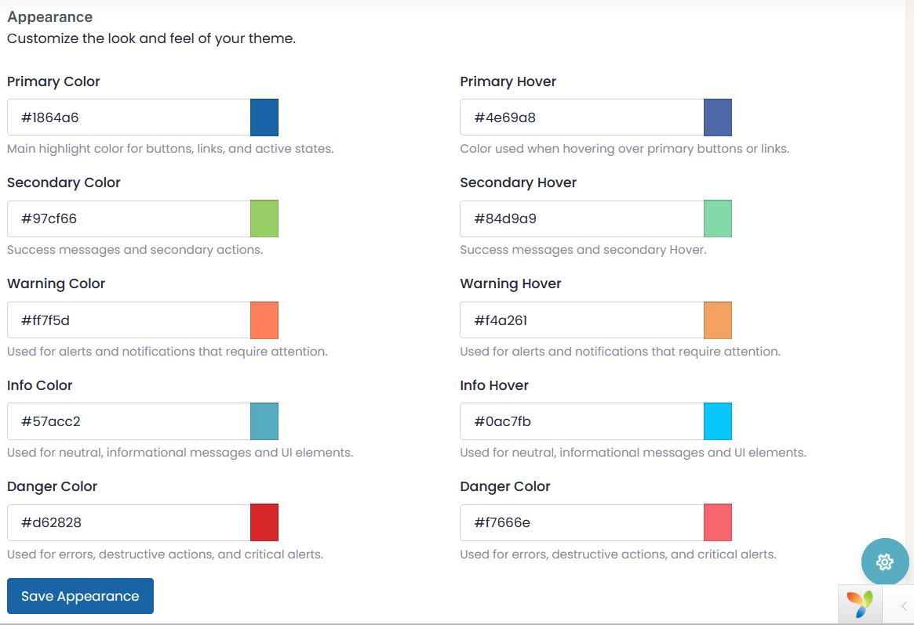

# 🎨 Appearance Settings

The **Appearance Settings** section of the Yii2 Admin Theme Extension enables administrators to fully customize the visual identity of the backend interface by defining color schemes for various UI elements.

This form allows for real-time updates of theme colors using intuitive color pickers and supports primary, secondary, warning, info, and danger categories — including their hover states.

---

## 🖌️ Available Color Settings

| Setting                 | Description                                                                 |
|-------------------------|-----------------------------------------------------------------------------|
| **Primary Color**        | Main highlight color for buttons, links, and active states.                |
| **Primary Hover**        | Color used when hovering over primary buttons or links.                    |
| **Secondary Color**      | Color used for success messages and secondary actions.                     |
| **Secondary Hover**      | Color used when hovering over secondary elements.                          |
| **Warning Color**        | Alerts and notifications requiring user attention.                         |
| **Warning Hover**        | Hover color for warning elements.                                          |
| **Info Color**           | Neutral informational messages and UI highlights.                          |
| **Info Hover**           | Hover color for informational elements.                                    |
| **Danger Color**         | Used for errors, destructive actions, and critical alerts.                 |
| **Danger Hover**         | Hover color for danger elements.                                           |

All colors can be picked using the integrated color picker for a user-friendly customization experience.

---

## 🧩 Implementation Notes

- Settings are stored in the `admin_theme_setting` table.
- Each color is applied globally through dynamic CSS or inline styles.
- Form submission uses Yii2's `ActiveForm` and is protected with CSRF tokens.
- Defaults are provided for each field to ensure fallback values are always present.

---

## 💡 Extending

You can:
- Add new color roles (e.g., accent, muted) by replicating the row structure.
- Enhance color previews using live swatches beside inputs.
- Integrate theme presets or dark/light mode toggles for advanced UI control.

---

## 📸 UI Preview

 
---

## 🔗 Related Documentation

- [Typography Settings](typography.md)
- [Branding & Logos](branding_logo_upload.md)
- [README.md](../README.md)

